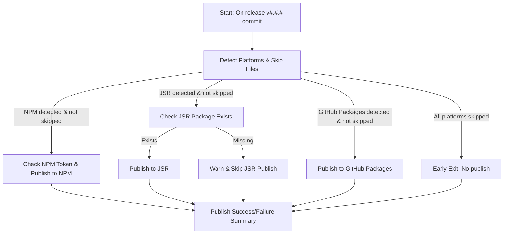

```mermaid
flowchart TD
    A[Start: On release v#.#.# commit] --> B[Detect Platforms & Skip Files]
    B -->|NPM detected & not skipped| C[Check NPM Token & Publish to NPM]
    B -->|JSR detected & not skipped| D[Check JSR Package Exists]
    D -->|Exists| E[Publish to JSR]
    D -->|Missing| F[Warn & Skip JSR Publish]
    B -->|GitHub Packages detected & not skipped| G[Publish to GitHub Packages]
    B -->|All platforms skipped| H[Early Exit: No publish]
    C & E & G --> I[Publish Success/Failure Summary]
    F --> I
    H --> I
```
